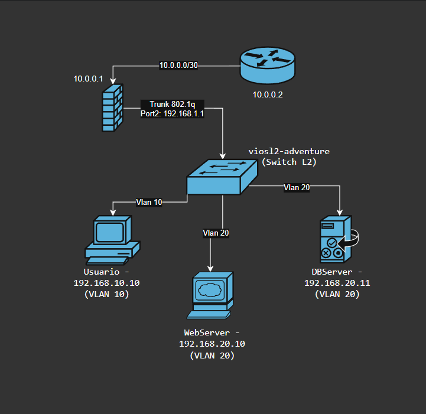
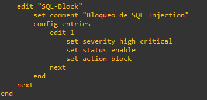

# Tarea Semana 2 - Práctica 1: Seguridad de Redes

**Nombre:** Josue Jose
**Matrícula:** 20241401
**Sección:** 5
**Fecha:** 25/9/2026

---

## 🎯 Objetivo

Implementar una topología de red con FortiGate que aplique políticas de seguridad, IPS (detección de SQL Injection), filtrado de aplicaciones (.exe) y rate limiting (Anti-DoS).

---

## 🗺️ Topología

**Descripción:**
- **FortiGate-7.0.9**: Firewall perimetral con políticas de seguridad.
- **R1 (Cisco 7200)**: Router de borde.
- **vIOS-L2**: Switch de capa 2 con VLANs.
- **Usuario**: VPCS en VLAN 10 (192.168.10.10).
- **WebServer**: VPCS en VLAN 20 (192.168.20.10).
- **DBServer**: VPCS en VLAN 20 (192.168.20.11).

---

## 📋 Configuración

### 1. FortiGate

#### Interfaces
| Interfaz | IP | VLAN | Descripción |
|----------|-----|------|-------------|
| port1 | 10.0.0.1/30 | - | WAN hacia R1 |
| port2 | 192.168.1.1/24 | - | LAN hacia switch |
| port2.10 | 192.168.10.1/24 | 10 | Gateway Usuarios |
| port2.20 | 192.168.20.1/24 | 20 | Gateway Servidores |

#### Políticas de Firewall
| ID | Nombre | Origen | Destino | Servicio | Acción | UTM |
|----|--------|--------|---------|----------|--------|-----|
| 1 | NAT-LAN-to-WAN | port2.10, port2.20 | port1 | ALL | Accept + NAT | - |
| 2 | Usuarios-a-WebServer | port2.10 | port2.20 | HTTP, HTTPS | Accept | IPS + App Control + Shaper |
| 3 | Bloquear-Usuarios-a-DBServer | port2.10 | port2.20 | MYSQL | Deny | - |
| 4 | WebServer-a-DBServer | port2.20 | port2.20 | MYSQL | Accept | - |

#### IPS (Detección de SQL Injection)
- **Sensor**: `SQL-Block`
- **Severidad**: High, Critical
- **Acción**: Block + Log

#### Filtrado de Aplicaciones (.exe)
- **Perfil**: `block-high-risk`
- **Categorías bloqueadas**: 2 (P2P) y 6 (Proxy/File Sharing)

#### Rate Limiting (Anti-DoS)
- **Traffic Shaper**: `Anti-DoS`
- **Ancho de banda garantizado**: 1000 Kbps
- **Ancho de banda máximo**: 5000 Kbps

---

### 2. Switch vIOS-L2

#### VLANs
| VLAN | Nombre | Puertos |
|------|--------|---------|
| 10 | USUARIOS | Gi0/1 |
| 20 | SERVIDORES | Gi0/2, Gi0/3 |

#### Trunk
- **Puerto**: Gi0/0
- **Encapsulación**: 802.1q
- **VLANs activas**: 1, 10, 20

---

### 3. Router R1

- **Interfaz**: FastEthernet0/0 con IP 10.0.0.2/30
- **Ruta por defecto**: 0.0.0.0/0 vía 10.0.0.1

---

### 4. VPCS

| Dispositivo | IP | Gateway | VLAN |
|-------------|-----|---------|------|
| Usuario | 192.168.10.10/24 | 192.168.10.1 | 10 |
| WebServer | 192.168.20.10/24 | 192.168.20.1 | 20 |
| DBServer | 192.168.20.11/24 | 192.168.20.1 | 20 |

---

## 🎥 Video Demostrativo

[Ver video en YouTube](PEGAR_ENLACE_AQUÍ)

---

## 📂 Configuraciones

- [FortiGate](Config/Fortigate.conf.txt)
- [Switch](Config/Switch.conf.txt)
- [Router R1](Config/R1.conf.txt)

---

## 📌 Conclusiones

- Se implementó una topología segmentada con VLANs para separar Usuarios de Servidores.
- Se aplicaron políticas de firewall que permiten el tráfico HTTP/HTTPS de Usuarios a WebServer.
- Se bloqueó el acceso de Usuarios al DBServer por MySQL (puerto 3306).
- Se configuró IPS para bloquear intentos de SQL Injection.
- Se aplicó filtrado de aplicaciones para bloquear descargas de archivos .exe.
- Se implementó rate limiting para mitigar ataques DoS.
- Se verificó la conectividad con pings exitosos y fallidos según las políticas configuradas.
